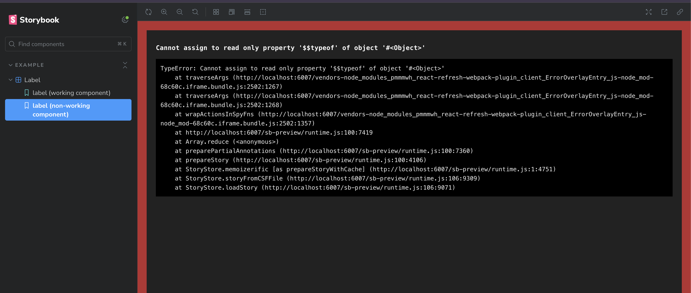

# Storybook 8.0.0-beta.3 bug reproduction

Issue: https://github.com/storybookjs/storybook/issues/26111



This repository demonstrates an existing bug in Storybook version 8.0.0-beta.3 (also occurring in 8.0.0-beta.2).


# Steps to preproduce:
- Clone the repository
- npm run install
- npm run storybook
- Go to story "label (non-working-component 1 or 2)"

--- 

Reproducing this is trivially simple, all you need to do is define Stories that pass JSX to the used component instead of just a string.

Example:

<b>Working stories: ✅ </b>

```tsx
export const LabelStory: Story = {
  name: "label (working component)",
  args: {
    label: 'Hi, this component fully works.',
  },
};
```
<b>Non-working stories: ❌</b>

```tsx
export const LabelStory2: Story = {
  name: "label (non-working component)",
  args: {
    label: <span>Hi, this component causes storybook crash :(</span>,
  },
};
```

It also doesn't matter whether the prop provided in `args` is handled in the component.

Example:

```tsx
export const LabelStory3: Story = {
    name: "label (non-working component)",
    args: {
        label: 'Hi, this component should fully works...',
        randomUnhandledPropInComponent: <span>...but trying to pass JSX prop causes it to crash:/</span>
    },
};
```

